<div align="center">
  
</div>

<div align="center">
  
</div>

<br>

## 🚀 About Me

```typescript
const jeyson = {
    name: "Jeyson Anibal Palacio Palma",
    title: "Senior Platform Engineer | Backend Architect | Future CTO",
    location: "Bogotá, Colombia 🇨🇴",
    experience: "10+ years",
    contact: {
        phone: "+57 300 713 5455",
        email: "japalacio0108@gmail.com",
        linkedin: "linkedin.com/in/jeyson-anibal-palacio-palma",
        github: "japalacio-08",
        twitter: "@japalacio072"
    },
    specialties: [
        "Multitenant SaaS Platforms",
        "Distributed Systems Architecture",
        "Infrastructure as Code",
        "Event-Driven Architecture"
    ],
    currentFocus: "Building scalable platform services & leading technical teams",
    languages: ["Spanish (Native)", "English (C1)"],
    funFact: "I architect systems that scale to millions while debugging with console.log! 😄"
};
```

<div align="center">

### 🎯 *"Code is like humor. When you have to explain it, it's bad."* – Cory House

</div>

### 💼 Professional Summary

> **Hands-on senior engineer and technical leader** with over **10 years of experience** designing scalable, multitenant applications and platform services. Proven track record building distributed backend systems, reusable service architectures, and integrating emerging infrastructure tools to improve developer velocity and system reliability.
>
> **Passionate about building both the foundation and the abstractions** to scale engineering teams and support rapid product evolution.

**Core Competencies:** `Python & Django Development` • `Ruby on Rails` • `Multitenant SaaS Platforms` • `Event-Driven Architecture (Kafka)` • `Infrastructure as Code (Terraform/Pulumi)` • `Distributed Systems & Microservices` • `API Design & gRPC` • `Database Optimization (PostgreSQL/ClickHouse)` • `Cloud DevOps (AWS/GCP)` • `Strategic Technical Leadership`

---

## 🛠️ Tech Arsenal

<div align="center">

### 💻 Languages & Frameworks


### ☁️ Cloud & Infrastructure


### 🗄️ Databases & Storage


### 🔄 Event Streaming & Orchestration


### 🛠️ DevOps & Tools


</div>

---

## 💼 Professional Experience

<div align="center">

### 🚀 **Current Roles**

</div>

<table>
<tr>
<td width="30%"></td>
<td width="70%">
<strong>Jan 2024 – Present | LATAM</strong><br>
• Designed core components of multitenant SaaS platform for HR automation<br>
• Built event-driven infrastructure with Kafka and PostgreSQL<br>
• Led Temporal adoption for durable job orchestration<br>
• Implemented IaC patterns with Terraform/Pulumi for zero-downtime deployments
</td>
</tr>
<tr>
<td></td>
<td>
<strong>Feb 2021 – Jan 2024 | Remote</strong><br>
• Architected multitenant payment infrastructure APIs for Mastercard<br>
• Built low-latency financial event processing with Kafka and gRPC<br>
• Integrated MCP-based AI models for fraud detection and risk scoring<br>
• Optimized ClickHouse OLAP tables for cross-tenant analytics
</td>
</tr>
</table>

<details>
<summary><b>🏢 Previous Experience</b></summary>
<br>

**🔹 Software Engineer @ Globant**
*Oct 2020 – Aug 2021 | Bogotá*

- Enterprise AI integrations for fintech and e-commerce clients
- Built distributed data pipelines with Pub/Sub and Celery
- Deployed ML models with versioned interfaces and A/B testing

**🔹 Enterprise Solutions Architect @ Mi Águila**
*Oct 2020 – Aug 2021 | Bogotá*

- Led platform modernization from monolith to microservices
- Built tenant-aware service registration and auth boundaries
- Managed Pulumi-based Kubernetes infrastructure

**🔹 Lead Engineer @ Packen**
*Oct 2019 – Oct 2020 | Bogotá*

- Built highly available microservices for logistics operations
- Introduced event sourcing for shipment lifecycle with Kafka
- Designed integration layer with external warehouse APIs

</details>

---

## 🎵 Currently Vibing To

<div align="center">
  <a href="https://open.spotify.com/user/japalacio0108">
    
  </a>
</div>

<div align="center">
  <i>🎧 Music fuels my coding sessions! Check out what's currently playing on my Spotify.</i>
</div>

---

## 🌟 What I'm Up To

```mermaid
graph LR
    A[☕ Coffee] --> B[🏗️ Architect]
    B --> C[💻 Code]
    C --> D[🚀 Deploy]
    D --> E[📊 Monitor]
    E --> F[🔄 Scale]
    F --> A
```

<div align="center">



</div>

<table align="center">
<tr>
<td align="center" width="50%">

**🔭 Currently Working On**

- Multitenant SaaS platform architecture at Revelo
- Event-driven microservices with Kafka & Temporal
- Infrastructure as Code with Terraform/Pulumi
- Scaling distributed systems for high-volume workloads

</td>
<td align="center" width="50%">

**🌱 Currently Learning**

- Advanced Kubernetes patterns & operators
- AI/ML integration with MCP protocols
- System design for financial services
- Leadership & technical mentoring

</td>
</tr>
</table>

### 🎯 Platform Readiness Highlights

<div align="center">

| 🏗️ **Multitenant SaaS** | 🔄 **Distributed Systems** | 🛠️ **Internal Platforms** |
|:---:|:---:|:---:|
| Designed isolated tenant environments with per-tenant observability | Applied Kafka, Temporal, gRPC in production with resilient async flows | Defined reusable CI/CD workflows and backend services across teams |

| 🤖 **AI Integration** | 🧠 **Strategic Thinking** |
|:---:|:---:|
| Built MCP-compatible wrappers and model deployment flows | Participated in platform-level tech decisions and system modularization |

</div>

---

## 🤝 Let's Connect

<div align="center">

[](https://linkedin.com/in/jeyson-anibal-palacio-palma)
[](mailto:japalacio0108@gmail.com)
[](https://twitter.com/japalacio072)
[](tel:+573007135455)

</div>

<div align="center">
  
</div>

---

## 🎓 Education & Certifications

<div align="center">

<table>
<tr>
<td align="center" width="50%">

<br><br>
<strong>Software Engineering Degree</strong><br>
<em>Universidad Piloto de Colombia</em>
</td>
<td align="center" width="50%">

<br><br>
<strong>OWASP Certified</strong><br>
<em>Security Best Practices</em><br>
<small>Valid through December 2024</small>
</td>
</tr>
</table>

### 🌍 Languages

**Spanish:** Native 🇨🇴 | **English:** Advanced (C1) 🇺🇸

</div>

---

## 📊 GitHub Analytics

<div align="center">

### 🏆 GitHub Trophies

[](https://github.com/ryo-ma/github-profile-trophy)

</div>

<details>
  <summary><b>📈 Detailed GitHub Stats</b></summary>
  <br/>

  <div align="center">
    
    
  </div>

  <div align="center">
    
  </div>

  <br/>
  <p align="center">
    <i>📝 Note: Top languages reflect my public repositories and don't indicate my experience or skill level.</i>
  </p>
</details>

<details>
  <summary><b>⚡ Recent GitHub Activity</b></summary>
  <br/>
  <div align="center">
    
  </div>
</details>

---

<div align="center">

### 💭 Random Dev Quote


### 🚀 Should I Deploy Today?

<div align="center">
  <a href="https://shouldideploy.today/">
    
  </a>

  <i>🟢 Green = Safe to deploy | 🔴 Red = Maybe not! | Live from <a href="https://shouldideploy.today/api?tz=America/Bogota">shouldideploy.today API</a>! 🚀</i>
</div>

</div>

---

<div align="center">
  
</div>

<div align="center">

**Thanks for visiting! 🚀 Let's build something amazing together!**


---

*Last updated: September 2025*

</div>
